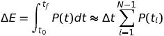

# Desafio para processo seletivo SHARENERGY 2021/22

Esse repositório se destina aos interessados em participar do processo seletivo da SHARENERGY 2021/22. As vagas são voltadas para desenvolvedores de aplicativos Web.

## Sobre a SHARENERGY

Acreditamos que as energias renováveis terão um lugar dominante em nossa economia pelo resto de nossas vidas. Trabalhamos no sentido de ampliar o impacto positivo que as energias renováveis podem ter no meio ambiente e nas nossas vidas. O sucesso da SHARENERGY é resultado de nossa equipe apaixonada, juntamente com nosso compromisso de oferecer a melhor solução.

Sabemos que negócios enfrentam desafios únicos e por isso oferecemos soluções turnkey, customizadas, economicamente viáveis e seguras.

A Startup figura entre as top 10 EnergyTechs do ranking 100 Open Startups desde 2018. Prova de que a inovação está enraizada em nossa cultura. Somos uma startup em estágio de crescimento e você trabalhará diretamente com os fundadores, ajudando a definir a visão, o produto e a experiência do usuário.

## Sobre a vaga

Já pensou em potencializar o setor que mais cresce na galáxia e trabalhar com uma solução que utiliza tecnologia web de ponta, altamente distribuída com foco em performance e disponibilidade? 👀

Os desenvolvedores da Sharenergy são responsáveis por criar e manter aplicações para clientes internos e externos, prover soluções escaláveis, resilientes e altamente disponíveis que sustentem picos de acesso além de atuar como referência técnica e tutores de outros desenvolvedores.

Procuramos por pessoas dinâmicas e que queiram estar aprendendo sempre. Nossa equipe é jovem, motivada e estamos sempre em busca de soluções criativas para alcançar os resultados que nossos clientes esperam. Se você tem esse perfil, é autoconfiante e tem facilidade para lidar com desafios diários, essa vaga é para você!

# O desafio

Criar uma aplicação Web que atenda às demandas listadas abaixo. O aplicativo deve apresentar uma interface amigável, bonita e limpa, na qual o usuário possa navegar através de botões.

### Contexto

No ramo da produção de energia fotovotaica, há a modalidade de produção compartilhada. Nessa modalidade, diferentes pessoas investem na construção de uma mesma usina fotovoltaica e dividem o retorno finaceiro referente à energia gerada pela usina. A aplicação desenvolvida no desafio visa, de maneira bastante simplificada, gerenciar as informações de produção de usinas fotovoltaicas e de nossos clientes (investidores das usinas).

### Arquitetura

Desenvolver apenas um front-end em ReactJS.

Note que, a princípio, esse front-end irá conter os dados hard-coded, simulando a existência de um backend.

### Requisitos de código

- A formatação do código deve ser consistente e limpa, de maneira a gerar um código legível. Se desejar, pode-se fazer isso utilizando um linter.

### Demanda 1: visualização de dados de uma usina fotovoltaica (gráfico)

A aplicação deve conter um objeto com os dados do arquivo [dadosUsina.json](dadosUsina.json), que contém informações de um dia de produção de uma usina fotovotaica.

- "tempo_h" denota o horário em horas decimais
  - Por exemplo, o horário de 5h e 45min corresponde a "tempo_h": 5.75
- "tensao_V" é a tensão elétrica em volts
- "corrente_A" é a corrente elétrica em amperes
- "potencia_kW" é a potência gerada em kilowatts
- "temperatura_C" é a temperatura em graus Celsius
   
A aplicação deve plotar os dados em um gráfico de uma variável de interesse (tensão, corrente, potência ou temperatura) em função do tempo. A aplicação deve plotar apenas uma variável por vez no gráfico e possuir uma opção que permita o usuário escolher qual variável será mostrada. Para tanto, pode-se utilizar, por exemplo, uma lista suspensa ou um input radio.

### Demanda 2: gerenciamento de clientes (CRUD)

A aplicação deve ser capaz de gerenciar os dados de nossos clientes, isto é, de investidores de usinas fotovoltaicas.

Inicializar o banco de dados de clientes (na realidade, uma mera array no código) com os dados fictícios de clientes contidos em [dadosClientes.json](dadosClientes.json).

- "numeroCliente" é o número de referência do cliente
- "nomeCliente" é o nome do cliente
- "usinas" lista as usinas em que o cliente tem participação
- "usinaId" é o número de referência da usina
- "percentualDeParticipacao" é o percentual de participação do cliente na geração elétrica da usina

A aplicação deve possuir os recursos básicos de CRUD (Create, Read, Update, Delete) de modo que seja possível editar os dados de um cliente específico e exibir as informações de todos os clientes.

### Demanda 3: retorno financeiro dos clientes (raciocínio lógico)

*A aplicação deve estimar o retorno financeiro obtido por cada cliente oriundo da energia produzida pela usina fotovoltaica no dia.*

*Considere como valor da energia elétrica: R\$0,95 / kWh*

Exemplo de como calcular:

Primeiramente, a aplicação deve calcular a energia elétrica total produzida no dia utilizando as informações de potência em função do tempo disponíveis no objeto [dadosUsina.json](dadosUsina.json). Lembre-se que, fisicamente, a potência P (kW) é a derivada no tempo t (h) da energia E (kWh), P = dE/dt. Portanto, a energia gerada pode ser calculada a partir da potência por: 
      
   
   <!--
      Imagem gerada pelo site: http://www.sciweavers.org/free-online-latex-equation-editor
      Foi usado o comando LaTeX: " \Delta E = \int_{t_0}^{t_f}P(t)dt  \approx \Delta t  \sum_{i = 1}^{N-1} P(t_i) "
      Font: Arev (padrão), Font size: 12 (padrão)
   -->
   Em que ΔE é a energia gerada (kWh), t0 é o instante de tempo inicial (h), tf é o instante de tempo final (h), Δt é o intervalo de tempo em que os dados foram amostrados (h), i indica a posição do dado no registro (i = 1, ..., N) e N é o número total de dados amostrados.

   Por exemplo, para os dados hipotéticos apresentados na tabela abaixo:
i | Tempo (h) | Potência (kW)
:---: | :---: | :---:
1 | 6,0 | 5,0
2 | 11,0 | 20,0
3 | 16,0 | 15,0
4 | 21,0 | 0,0

O intervalo de tempo de amostragem é: Δt = 11 h - 6h = 16 h - 11 h = 21 h - 16 h = 5 h. O número total de dados é: N = 4. E a energia gerada no dia é: ΔE = 5 h &times; (5 kW + 20 kW + 15 kW) = 5 h &times; 40 kW = 200 kWh.
   
De posse dos valores da energia gerada (ΔE) e do preço da energia elétrica, a receita total pode ser facilmente determinada. Por fim, o retorno de cada cliente pode ser calculado com base no percentual de participação de cada cliente em relação a usina. No caso dos dados de clientes fornecidos, essa informação está na chave "percentualUsina" do objeto [dadosClientes.json](dadosClientes.json).

No exemplo anterior, como a usina produziu 200 kWh no dia, a receita total no dia é: 200 kWh &times; R\$0,95 / kWh = R\$190,00. Além disso, se dois clientes tiverem cada 50% de participação da usina, cada cliente terá um retorno de: (50 / 100) &times; R\$190,00 = R\$95,00.

### Aprimoramentos adicionais da aplicação (opcional)

A aplicação criada para o desafio pode ser aprimorada com recursos pensados por você. A seguir, foram listadas algumas sugestões do que poderia ser feito:

- Utilizar MaterialUI
- Ao invés de apenas um front-end, utilizar um backend para o CRUD
- Documentação
- Responsividade
- Contas de usuário
  - Proteção contras modificações de pessoas não autorizadas
- Em relação ao gerenciamento de clientes:
  - Permitir que o usuário adicione ou delete clientes
  - Adicionar mais campos aos formulários de criação e edição de clientes
  - Fornecer opções de filtragem ou busca para listar apenas parte dos clientes
- Exibir estatística descritiva dos dados dos gráficos (por exemplo, média, desvio-padrão, mínimo, máximo, etc.)
- Implementação de fórmula mais precisa de integração numérica para o cálculo de ΔE
- Realizar validação dos dados 

### Quais ferramentas posso utilizar para resolver o desafio?

Com exceção do ReactJS, não será especificado um conjunto de ferramentas específico que pode ser usado. Não obstante, será considerado como um diferencial caso você adote as mesmas ferramentas com as quais nós trabalhamos. 

### Mas, afinal, quais ferramentas a Sharenergy utiliza?

* Javascript, Typescript e Go
* Framework para front-end: [React JS](https://pt-br.reactjs.org/) com roteamento [react-router-dom](https://www.npmjs.com/package/react-router-dom)
* Para back-end: [Node.js](https://nodejs.org/en/) e [Go](https://golang.org/)
* Banco de dados: [MongoDB](https://www.mongodb.com/) do lado do servidor e [Minimongo](https://guide.meteor.com/collections.html) do lado do cliente (cache)
* Validação de dados: [Schema-utils](https://www.npmjs.com/package/schema-utils) 
* UI: [CSS 3](https://www.w3.org/Style/CSS/), [Material-UI](https://material-ui.com/pt/) e [Reflexbox](https://rebassjs.org/reflexbox/)
* Gráficos: [Recharts](https://recharts.org/en-US/)

## O que devo entregar?

Esperamos de você duas entregas: o código da aplicação no GitHub e um vídeo explicativo no YouTube.

### Instruções

Faça um fork desse repositório. Em seguida, crie uma branch, cujo nome é o seu nome completo.

Resolva o desafio realizando versionamento local e remoto. Fique à vontade em criar outras branches durante o desenvolvimento do código.

Ao finalizar o desafio, faça um pull request de sua branch para esse repositório.

Inclua no README.md uma listagem de todas as dependências utilizadas e uma instrução de instalação e de execução da aplicação criada.

Além disso, faça um vídeo que explique o que você fez no desafio, com duração aproximada de 5 minutos. A facecam é opcional, mas bem-vinda. O vídeo deve ser postado no YouTube (pode deixar como não listado) e seu link deve ser colocado no README.md.

### Prazo limite de entrega

O pull request com sua solução do desafio deve ser feito até a data especificada no corpo do email que você recebeu com a descrição do desafio.
