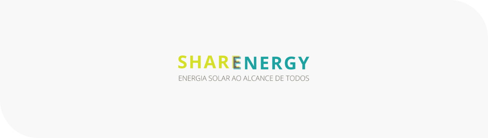

<!-- PROJECT LOGO -->
<br />
<p align="center">
  <a href="https://github.com/othneildrew/Best-README-Template">
    
  </a>

  <h3 align="center">Desafio para processo seletivo SHARENERGY 2021/22</h3>

  <p align="center">
    Um gerenciador simples com ReactJS, React-router-dom, json-server, Animate-CSS e Bootstrap!
    <br />
  </p>
</p>

<!-- ABOUT THE PROJECT -->
## Sobre o projeto

[![Product Name Screen Shot][product-screenshot]](https://example.com)

### Construção do app

Este projeto foi criando com:

* [ReactJS](https://reactjs.org/)
* [React Router Dom](https://reactrouter.com/)
* [json-server](https://www.npmjs.com/package/json-server)
* [Animate-CSS](https://github.com/animate-css/animate.css)
* [Bootstrap](https://getbootstrap.com/)


<!-- GETTING STARTED -->
## Iniciando o projeto
1. Clone o repositório
 ```sh
   git clone https://github.com/wandskk/desafio-sharenergy-2021-22.git
 ```
2. Vá até a pasta
 ```sh
   cd sharenergy
 ```
3. Instale as dependências do projeto
 ```sh
   npm install or npm i
 ```
4. Execute o projeto
```sh
   npm start
 ```
5. Execute json-server
```sh
   npm run backend
 ```
6. Acesse o link
 ```sh 
    http://localhost:3000/
```


<!-- CONTACT -->
## Contact
Project Link: [https://github.com/wandskk/desafio-sharenergy-2021-22/tree/wanderson-kenedy-soares-de-oliveira](https://github.com/wandskk/desafio-sharenergy-2021-22/tree/wanderson-kenedy-soares-de-oliveira)


[product-screenshot]: src/Images/sistema.png
